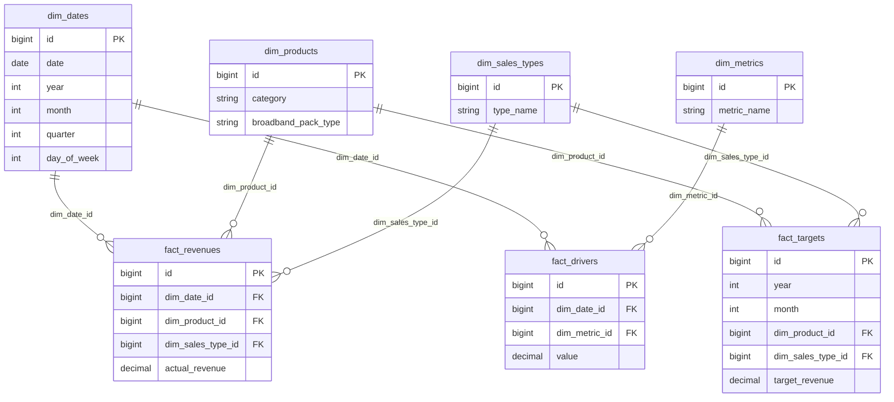

# 📊 Dashboard Analytics Project

Dokumentasi lengkap mengenai struktur database, skema Star Schema, lokasi file query & seeder, serta panduan langkah demi langkah untuk menjalankan proyek dari awal.

---

## 📁 1. Struktur & Lokasi File Database

Berikut adalah pemetaan folder dan file yang berhubungan dengan pengelolaan database pada proyek ini:

### 1.1 Tempat Query Database untuk Di-migrate (Migrations)
📁 **Lokasi:** [`database/migrations/`](file:///c:/xampp/htdocs/Dashboard_Analysis1/database/migrations)

Folder ini berisi file migrasi Laravel yang mendefinisikan struktur tabel database (Star Schema):
* 📄 [`0001_01_01_000000_create_users_table.php`](file:///c:/xampp/htdocs/Dashboard_Analysis1/database/migrations/0001_01_01_000000_create_users_table.php) — Membuat tabel pengguna sistem (`users`, `password_reset_tokens`, `sessions`).
* 📄 [`0001_01_01_000001_create_cache_table.php`](file:///c:/xampp/htdocs/Dashboard_Analysis1/database/migrations/0001_01_01_000001_create_cache_table.php) — Membuat tabel pendukung cache Laravel.
* 📄 [`0001_01_01_000002_create_jobs_table.php`](file:///c:/xampp/htdocs/Dashboard_Analysis1/database/migrations/0001_01_01_000002_create_jobs_table.php) — Membuat tabel antrean pekerjaan (*queue/jobs*).
* 📄 [`2026_07_24_000000_create_star_schema_dimensions_table.php`](file:///c:/xampp/htdocs/Dashboard_Analysis1/database/migrations/2026_07_24_000000_create_star_schema_dimensions_table.php) — Membuat **Tabel Dimensi** (`dim_dates`, `dim_products`, `dim_sales_types`, `dim_metrics`).
* 📄 [`2026_07_24_000001_create_star_schema_facts_table.php`](file:///c:/xampp/htdocs/Dashboard_Analysis1/database/migrations/2026_07_24_000001_create_star_schema_facts_table.php) — Membuat **Tabel Fakta** (`fact_revenues`, `fact_drivers`).
* 📄 [`2026_07_31_000000_create_fact_targets_table.php`](file:///c:/xampp/htdocs/Dashboard_Analysis1/database/migrations/2026_07_31_000000_create_fact_targets_table.php) — Membuat **Tabel Fakta Target** (`fact_targets`).
* 📄 [`2026_07_31_000001_remove_target_revenue_from_fact_revenues_table.php`](file:///c:/xampp/htdocs/Dashboard_Analysis1/database/migrations/2026_07_31_000001_remove_target_revenue_from_fact_revenues_table.php) — Refactoring memisahkan kolom target dari `fact_revenues`.

---

### 1.2 Skema Database (Star Schema Architecture)
Arsitektur database dirancang menggunakan pola **Star Schema (Data Warehouse OLAP)** untuk mengoptimalkan performa kueri analitis dan agregasi data:



#### Ringkasan Tabel:
1. **Tabel Dimensi (`dim_*`)**:
   * `dim_dates`: Menyimpan dimensi tanggal, tahun, bulan, kuartal.
   * `dim_products`: Kategori produk (`Broadband`, `Digital`, `Voice`, `SMS`, `IR`, `Others`) dan tipe paket (`Core`, `CVM`, `Acquisition`, dll).
   * `dim_sales_types`: Tipe penjualan (`BAU / Existing Sales` & `New Sales`).
   * `dim_metrics`: Tipe metrik penggerak (`Playing User`, dll).
2. **Tabel Fakta (`fact_*`)**:
   * `fact_revenues`: Menyimpan transaksi pendapatan aktual harian.
   * `fact_targets`: Menyimpan alokasi target pendapatan bulanan per produk & tipe sales.
   * `fact_drivers`: Menyimpan data metrik operasional harian.

---

### 1.3 Seeder Database
📁 **Lokasi:** [`database/seeders/`](file:///c:/xampp/htdocs/Dashboard_Analysis1/database/seeders)

File seeder digunakan untuk mengisi data awal (*initial data*) dan data sampel (*dummy analytics data*):
* 📄 [`DatabaseSeeder.php`](file:///c:/xampp/htdocs/Dashboard_Analysis1/database/seeders/DatabaseSeeder.php) — Entry point utama seeder yang mengeksekusi `UserSeeder` dan `DashboardDataSeeder`.
* 📄 [`UserSeeder.php`](file:///c:/xampp/htdocs/Dashboard_Analysis1/database/seeders/UserSeeder.php) — Menyiapkan akun pengguna administrator.
* 📄 [`DashboardDataSeeder.php`](file:///c:/xampp/htdocs/Dashboard_Analysis1/database/seeders/DashboardDataSeeder.php) — Mengisi tabel dimensi dan fakta dummy (Target Tahunan Rp 120 Miliar / Target Bulanan Rp 10 Miliar, rasio BAU 80% vs New Sales 20%, sebaran produk, dan tren harian).

---

### 1.4 Query Database (Logic & Service Layer)
Kueri database dieksekusi dan didokumentasikan di beberapa lokasi utama:

1. **Aplikasi Backend (Service Layer & Controllers)**:
   * 📄 [`app/Services/DashboardService.php`](file:///c:/xampp/htdocs/Dashboard_Analysis1/app/Services/DashboardService.php) — Tempat logika **Query SQL utama** menggunakan Laravel DB Query Builder / Eloquent (perhitungan revenue MTD/YTD, agregasi harian/bulanan/kuartalan, pencapaian target, dan breakdown produk).
   * 📄 [`app/Http/Controllers/Api/DashboardController.php`](file:///c:/xampp/htdocs/Dashboard_Analysis1/app/Http/Controllers/Api/DashboardController.php) — Controller API yang memanggil service query dan menyajikan response JSON ke frontend.
   * 📁 [`app/Models/`](file:///c:/xampp/htdocs/Dashboard_Analysis1/app/Models) — Model Eloquent ORM (`DimProduct.php`, `DimSalesType.php`, `FactTarget.php`, `User.php`).

2. **Dokumentasi & Raw SQL Query**:
   * 📄 [`reademequery.md`](file:///c:/xampp/htdocs/Dashboard_Analysis1/reademequery.md) — Dokumen analisis komparasi query SQL MySQL Workbench vs API Dashboard Backend (penjelasan detail perbedaan time scope MTD vs Full Year).
   * 📄 [`insert.sql`](file:///c:/xampp/htdocs/Dashboard_Analysis1/insert.sql) — File skrip SQL mentah untuk referensi kueri manual.

---

## 🚀 2. Panduan Menjalankan Proyek dari Awal

Ikuti langkah-langkah berikut untuk mengonfigurasi dan menjalankan proyek dari kondisi bersih (*fresh install*):

### Prasyarat Environment
Pastikan perangkat Anda sudah terinstall:
* **PHP** `>= 8.2` (misal via XAMPP / Laragon)
* **Composer** (Package Manager PHP)
* **Node.js** `>= 18.x` & **npm**
* **MySQL / MariaDB** (Aktif di XAMPP / MySQL Server)

---

### Langkah 1: Clone / Navigasi ke Folder Proyek
Buka terminal / Command Prompt / PowerShell, lalu masuk ke direktori proyek:
```bash
cd c:\xampp\htdocs\Dashboard_Analysis1
```

### Langkah 2: Install Dependensi PHP (Composer)
Jalankan perintah berikut untuk menginstall library backend Laravel:
```bash
composer install
```

### Langkah 3: Setup File Environment (`.env`)
1. Salin file `.env.example` menjadi `.env`:
   ```bash
   # Di Windows Command Prompt / PowerShell:
   copy .env.example .env
   
   # Atau di Bash / Git Bash:
   cp .env.example .env
   ```
2. Buka file `.env` dan pastikan konfigurasi database sudah sesuai (misalnya database bernama `Dashboard1`):
   ```env
   DB_CONNECTION=mysql
   DB_HOST=127.0.0.1
   DB_PORT=3306
   DB_DATABASE=Dashboard1
   DB_USERNAME=root
   DB_PASSWORD=
   ```
   > ⚠️ **Catatan:** Pastikan Anda sudah membuat database `Dashboard1` di MySQL (misal via phpMyAdmin atau MySQL Workbench) sebelum melanjutkan ke langkah migrasi.

3. Generate Application Key Laravel:
   ```bash
   php artisan key:generate
   ```

### Langkah 4: Jalankan Migration Database
Eksekusi migrasi untuk membuat seluruh tabel dimensi dan fakta:
```bash
php artisan migrate
```
*(Jika ingin mereset database dari awal, gunakan `php artisan migrate:fresh`)*

### Langkah 5: Jalankan Seeder Database
Isi data awal dimensi, fakta revenue, target, dan akun admin:
```bash
php artisan db:seed
```
*(Atau Anda dapat menjalankan migrasi sekaligus seeder sekaligus dengan: `php artisan migrate:fresh --seed`)*

### Langkah 6: Install Dependensi Frontend (npm)
Install semua library React, Vite, TailwindCSS, MUI, dan komponen UI lainnya:
```bash
npm install
```

### Langkah 7: Build / Jalankan Frontend Assets
Pilih salah satu mode berikut:

* **Mode Development (Hot Reloading):**
  ```bash
  npm run dev
  ```
* **Mode Production Build:**
  ```bash
  npm run build
  ```

### Langkah 8: Jalankan Web Server Laravel
Buka terminal baru, lalu jalankan server Laravel:
```bash
php artisan serve
```
Aplikasi sekarang dapat diakses melalui browser di: **`http://127.0.0.1:8000`**

---

## 🔑 3. Akun Login Default

Setelah seeder berhasil dijalankan, Anda dapat login ke aplikasi menggunakan kredensial default:

* 📧 **Email:** `admin@dashboard.com`
* 🔑 **Password:** `admin123`

*(Kredensial ini dapat diatur melalui variabel `ADMIN_EMAIL` dan `ADMIN_PASSWORD` pada file `.env`)*

---

## 🛠️ 4. Ringkasan Perintah Penting (Quick Reference)

| Perintah | Deskripsi |
| :--- | :--- |
| `composer install` | Menginstall package backend PHP |
| `copy .env.example .env` | Membuat file konfigurasi environment |
| `php artisan key:generate` | Membuat encryption key aplikasi |
| `php artisan migrate` | Menjalankan migrasi struktur database |
| `php artisan db:seed` | Mengisi data sampel & user admin |
| `php artisan migrate:fresh --seed` | Reset total database & isi ulang seeder |
| `npm install` | Menginstall package frontend Node.js |
| `npm run dev` | Menjalankan Vite dev server (frontend) |
| `npm run build` | Melakukan compile asset frontend untuk production |
| `php artisan serve` | Menjalankan Laravel development server |

---

## 📄 5. Dokumentasi Terkait
* 📘 [`reademequery.md`](file:///c:/xampp/htdocs/Dashboard_Analysis1/reademequery.md) — Penjelasan detail mengenai analisis kueri MySQL Workbench vs Endpoint API Dashboard.
